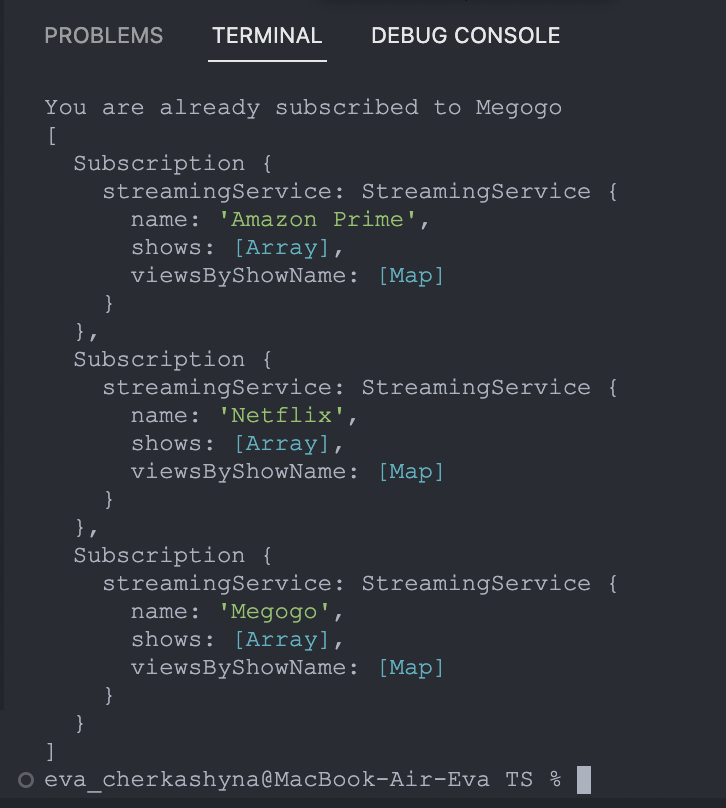
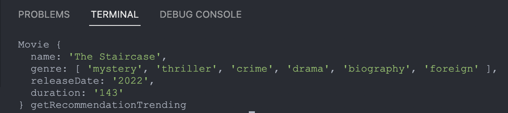

# User
Для прикладу створимо User
```JS
 let yeva = new User()
 ```

Перевіримо метод subscribe(streamingService)  - він підписує користувача на стрімінговий сервіс. Повертає об’єкт Subscription.
Для цього нам треба оформити підписку на StreamingService 

```JS 
//Шоу для StreamingService
let amazonPrimeShows = [
  new Movie('Revival', ['drama', 'abroad',], '2017', "145"),
  new Movie('Elvis', ['drama', 'biography', 'foreign', 'thriller'], '2022', "145"),
  new Series('Endless Night', ['foreign', 'fantasy', 'thriller'], '2022', "145",
    [
      new Episode('The Body in the Library', ['foreign', 'fantasy', 'thriller'], '2022', "143"),
      new Episode('The Murder at the Vicarage', ['foreign', 'fantasy', 'thriller'], '2022', "143"),
      new Episode('4.50 from Paddington', ['foreign', 'fantasy', 'thriller'], '2022', "145"),
      new Episode('A Murder Is Announced', ['foreign', 'fantasy', 'thriller'], '2022', "345"),
      new Episode('4.50 from Paddington', ['foreign', 'fantasy', 'thriller'], '2022', "145"),
      new Episode('Sleeping Murder', ['foreign', 'fantasy', 'thriller'], '2022', "345")
    ]),
  new Movie('The Staircase', ['mystery', 'thriller', 'crime', 'drama', 'biography', 'foreign'], "2022", "143"),
  new Movie('Parot', ['mystery', 'thriller', 'crime', 'foreign'], '2021', "125"),
  new Movie('30 Coins', ['mystery', 'thriller', 'horror', 'foreign'], '2020', "200"),
  new Movie('Memory', ['action', 'thriller', 'foreign'], '2022', "345"),
  new Movie('Free Guy', ['comedy', 'action', 'adventure', 'thriller', 'foreign'], '2022', "200"),
  new Movie('Doctor Strange in the Multiverse of Madness', ['action', 'thriller', 'horror', 'adventure', 'foreign', 'fantasy'], '2022', "145"),
  new Movie('Doctor Strange', ['action', 'horror', 'thriller', 'adventure', 'foreign', 'fantasy'], '2016', "143"),
  new Movie('Infinite', ['action', 'foreign'], '2022', "145"),
  new Movie('Love and Bloggers', ['comedy'], '2022', "345"),
  new Movie('Eraser: Reborn', ['action', 'foreign'], '2022', "145"),
  new Movie('And There Will Be People', ['documentary'], '2022', "280"),
  new Movie('Super Pumped: The Battle for Uber', ['drama', 'foreign'], '2022', "365"),
  new Movie('Memory', ['action', 'thriller', 'foreign'], '2022', "200"),
  new Movie('Heatwave', ['thriller', 'foreign'], '2022', "145"),
  new Movie('Peacemaker', ['adventure', 'foreign', 'comedy', 'crime', 'fantasy', 'action'], '2022', "200")
]
//Створюємо StreamingService
let amazonPrime = new StreamingService('Amazon Prime', amazonPrimeShows)
//Створюємо підписку
yeva.subscribe(amazonPrime)
yeva.subscribe(netflix)
yeva.subscribe(megogo)
yeva.subscribe(megogo)//Повторна підписка
```


# Subscription
Watch()
```JS
yeva.subscriptions.forEach(key => {
  if (key.streamingService == amazonPrime) {
    key.watch('Free Guy') // фільм що є в amazonPrime (должен спрацювати)
    key.watch('Death on the Nile') // фільм якого немає в amazonPrime (не повинен працювати)
    key.watch('A Murder Is Announced') // епізод серіалу, який міститься в серіалі, який є в amazon Prime (должен сработать)
    key.watch('Fifth Episode') // епізод серіалу, якого немає в серіалах amazon Prime (не повинен працювати)
  }
})
```


getRecommendationTrending()
```JS
yeva.subscriptions.forEach(key => {
  if (key.streamingService == amazonPrime) {
    console.log(key.getRecommendationTrending(),'getRecommendationTrending')
  }
})
```



getRecommendationByGenre()
```JS
yeva.subscriptions.forEach(key => {
  if (key.streamingService == amazonPrime) {
    console.log(key.getRecommendationTrending(),'getRecommendationTrending')
    console.log(key.getRecommendationByGenre(),'getRecommendationByGenre no value')//
    console.log(key.getRecommendationByGenre('thriller'),'getRecommendationByGenre thriller')
  }
})
```


# StreamingService

addShow()
```JS
yeva.subscriptions.forEach(key => {
  if (key.streamingService == amazonPrime) {
    key.streamingService.addShow(new Movie('Death on the Nile', ['mystery', 'crime', 'thriller', 'drama', 'foreign'], '2022', "200"))//додати фільм, якого немає в amazonPrime (треба додати)
    key.streamingService.addShow(new Movie('Elvis', ['drama', 'biography', 'foreign', 'thriller'], '2022', "145"))// додати фільм, що є в amazonPrime(не потрібно додавати)
    key.streamingService.addShow(new Series('The New Pope', ['drama', 'foreign'], '2019', "2:00",
      [
        new Episode('First Episode', ['drama', 'foreign'], '2019', "145"),
        new Episode('Second Episode', ['drama', 'foreign'], '2019', "245"),
        new Episode('Third Episode', ['drama', 'foreign'], '2019', "245"),
        new Episode('Fourth Episode', ['drama', 'foreign'], '2019', "200"),
        new Episode('Fifth Episode', ['drama', 'foreign'], '2019', "143"),
        new Episode('Sixth Episode', ['drama', 'foreign'], '2019', "345"),
        new Episode('Sleeping Murder', ['foreign', 'fantasy', 'thriller'], '2022', "345")
      ]))//  додати серіал, в якому є епізод іншого серіалу, що є в amazonPrime (не потрібно додавати)
    key.streamingService.addShow(new Episode('His Last Vow', ['detectives', 'trilleries', 'abroad'], '2009', "145"),)// додати епізод в amazon Prime (не повинен додавати)
  }
})
```


getMostViewedShowsOfYear()
```JS
yeva.subscriptions.forEach(key => {
  if (key.streamingService == amazonPrime) {
    console.log(key.streamingService.getMostViewedShowsOfYear("2012"))//нету фільмів з таким роком випуску (не повинен знайти)
    console.log(key.streamingService.getMostViewedShowsOfYear("2022"))//є фільми з таким роком випуску (повинен знайти)
   }
})
```


getMostViewedShowsOfGenre()
```JS
yeva.subscriptions.forEach(key => {
  if (key.streamingService == amazonPrime) {
    console.log(key.streamingService.getMostViewedShowsOfGenre("thriller"))//есть фильмы с таким годом выпуска (должен найти) 
    console.log(key.streamingService.getMostViewedShowsOfGenre("historical drama"))//нету фильмов с таким годом выпуска (не должен найти)
  } 
})
```


# Show
getDuration()

```JS
yeva.subscriptions.forEach(key => {
  if (key.streamingService == amazonPrime) {
    key.streamingService.shows.forEach((show) => console.log(show.getDuration()))
  }
})
```
